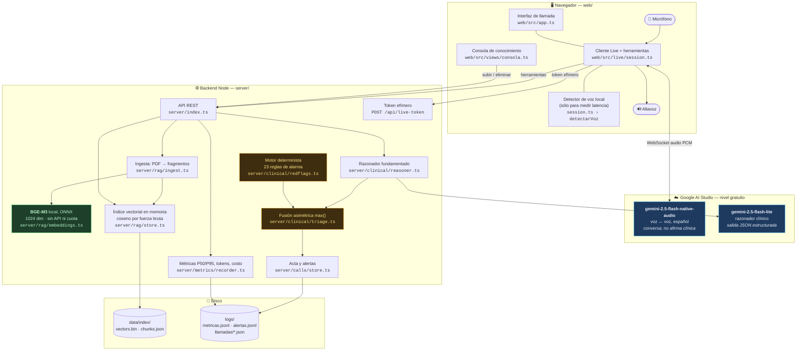
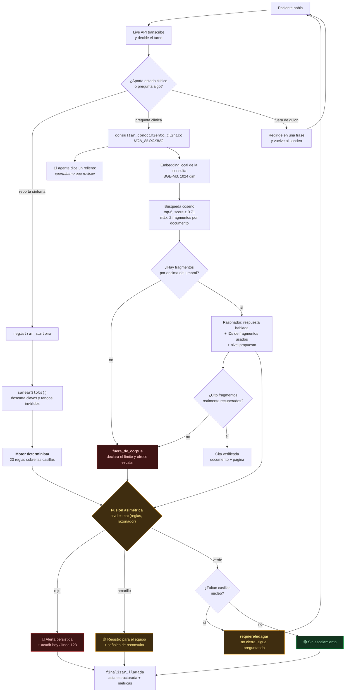
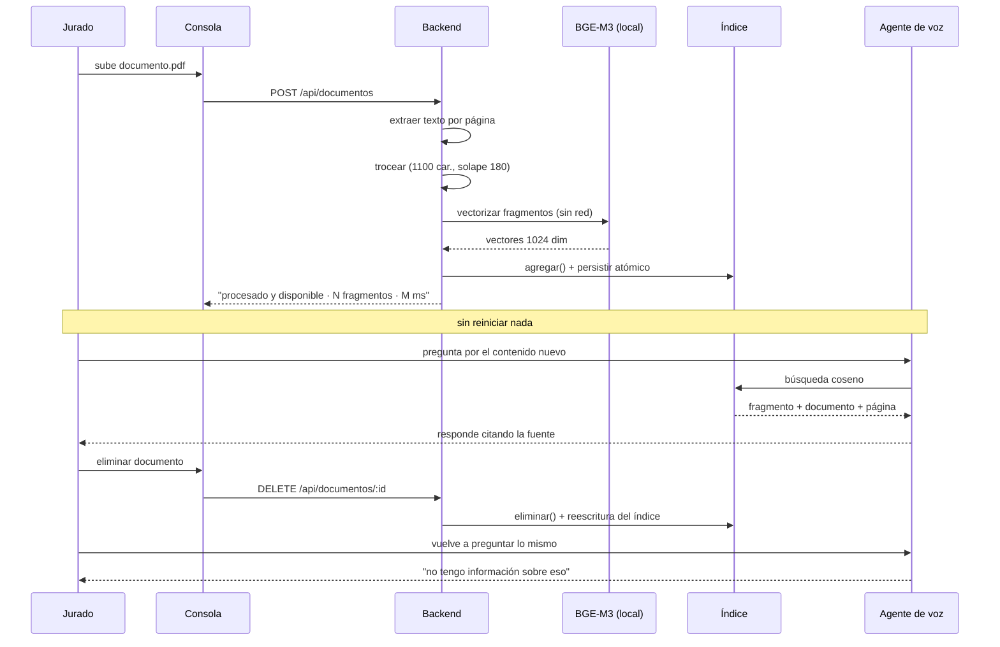

# Arquitectura y flujo de decisión — Centinela

Entregable 02. Este documento tiene dos diagramas: **cómo está construida la
solución** y **cómo decide el agente si escala o no**.

> El jurado toma elementos del diagrama al azar y los busca en el código. Cada
> caja de abajo lleva la ruta del archivo que la implementa.

---

## 1. Arquitectura de la solución

### La decisión estructural: dos modelos, dos responsabilidades

El modelo de voz **nunca afirma contenido clínico**. Conversa, interpreta
regionalismos, maneja interrupciones y llena casillas — pero todo lo que suene a
medicina entra por la herramienta `consultar_conocimiento_clinico`, que devuelve
un campo `decir` ya fundamentado en el corpus. El prompt le ordena pronunciarlo
literalmente.

Esto convierte "cero alucinaciones" de una súplica al modelo en una propiedad
de la arquitectura: si el corpus no sustenta la respuesta, no hay texto que
pronunciar, y el agente declara el límite.

---

## 2. Flujo de decisión del agente

### Por qué `max()` y no un promedio

La rúbrica declara que el falso negativo —no alertar cuando había que
alertar— es la falla catastrófica. Con `max()`, basta con que **una** de las
dos vías detecte riesgo para que la llamada escale. El modelo puede fallar; las
reglas siguen ahí. Las reglas pueden no cubrir un caso; el razonador con
contexto clínico sí.

Medido contra el ground truth del reto (`npm run eval`, 160 casos):

| | Resultado |
|---|---|
| Falsos negativos | **0 de 160** |
| Recall en `rojo` | **100 %** (12/12) |
| Recall en `amarillo` | **100 %** (25/25) |
| Verdes escalados de más | 17.9 % (22/123) — el costo aceptado |

Ese 17.9 % es el precio explícito de la asimetría: 22 pacientes sanos que una
enfermera revisa de más, a cambio de no perder ninguno de los 37 que sí
necesitaban atención.

### Qué mide exactamente el `requiereIndagar`

Un "verde" con casillas núcleo vacías no es un verde: es una decisión tomada
sin información. Las seis casillas núcleo son dolor, temperatura (o fiebre
referida, porque el paciente puede no tener termómetro), herida, movilidad,
náuseas/vómito y respiración. Mientras falte una, el agente no puede cerrar la
llamada como evolución esperada.

---

## 3. Conocimiento vivo (compuerta G5)

El identificador del documento deriva del SHA-256 de su contenido, así que
volver a subir el mismo archivo lo actualiza en vez de duplicarlo. La escritura
del índice es atómica (`.tmp` + `rename`): un corte a mitad de guardado no deja
el agente mudo.

---

## 4. Decisiones que se descartaron

| Alternativa | Por qué se descartó |
|---|---|
| **ChromaDB** | Exige un servicio aparte o binario nativo. Con ~6.3k fragmentos el coseno por fuerza bruta tarda milisegundos en Node: la base vectorial habría añadido una clase entera de fallos de arranque a cambio de nada, justo en la compuerta de 15 minutos. |
| **`gemini-embedding-001` por API** (descartado ya en desarrollo) | Fue la primera elección — evitaba una descarga de modelo al arranque. Se abandonó al chocar con `EmbedContentRequestsPerDayPerUserPerProjectPerModel-FreeTier`: 1.000 peticiones/día en el nivel gratuito, y una llamada de N textos consume N peticiones. Con ~6.300 fragmentos, ingerir el corpus agotaba la cuota del día antes de terminar — y peor, arriesgaba que la compuerta G5 fallara en plena evaluación si el jurado sube un documento de prueba con la cuota diaria ya en cero. BGE-M3 local elimina esa clase de fallo: no hay límite que agotar. |
| **STT → LLM → TTS en cascada** (Whisper + Llama + Piper) | Tres saltos de red y ~2.5 s de latencia por turno. La voz nativa mantiene prosodia, maneja interrupciones y responde en una fracción de eso. |

### Por qué BGE-M3 sí resultó viable, y la corrección que valió la pena hacer

La primera estimación de este documento decía "~2 GB de descarga, incompatible con
15 minutos" y por eso se descartó BGE-M3 en el diseño inicial. Esa cifra era la del
modelo en precisión completa. La versión que realmente se usa en producción con
`transformers.js` es la **cuantizada (`dtype: 'q8'`)**: **544 MB**, medidos, no
estimados. Descarga y carga en **32 segundos** en una conexión normal, y vectoriza
a ~105 ms por fragmento — el corpus completo tarda **~11 minutos**, sin red después
de la primera descarga y sin límite que agotar. La descarga ocurre una sola vez, al
primer arranque del servidor, antes de abrir el puerto (`server/index.ts`), así que
queda dentro de la ventana que mide la compuerta G2 y no interrumpe ninguna llamada.
| **Un solo modelo que conversa y razona** | El modelo de audio nativo es rápido pero pequeño; dejarle la afirmación clínica reintroduce el riesgo de alucinación que todo el diseño busca eliminar. |
| **Clave de API en el navegador** | Funciona, pero expone la credencial a cualquiera que abra las herramientas de desarrollo. Se emite un token efímero de 30 min desde el backend. |
