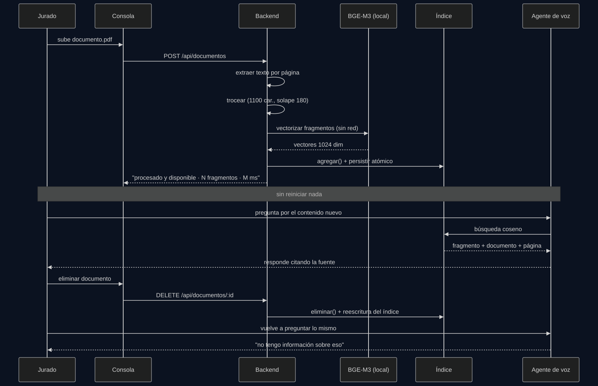
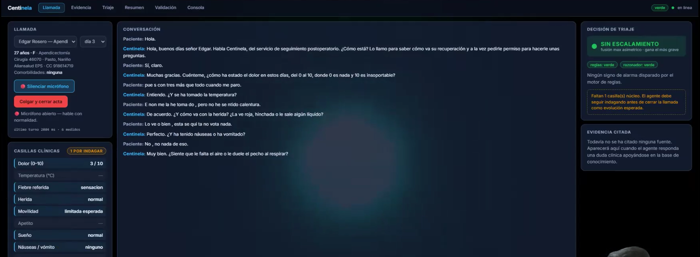
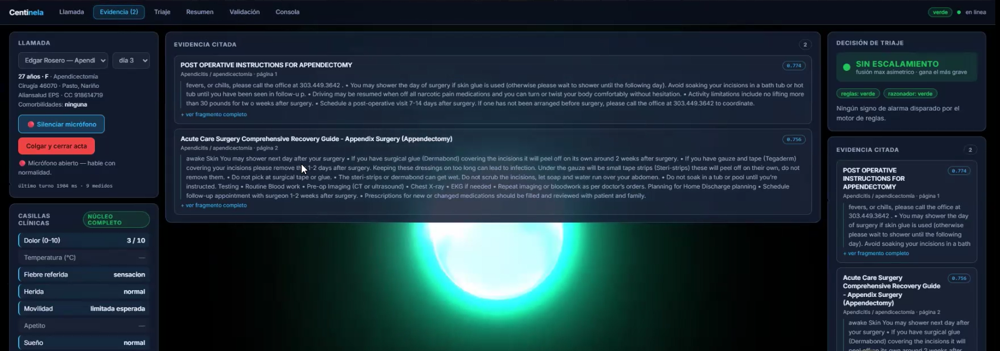
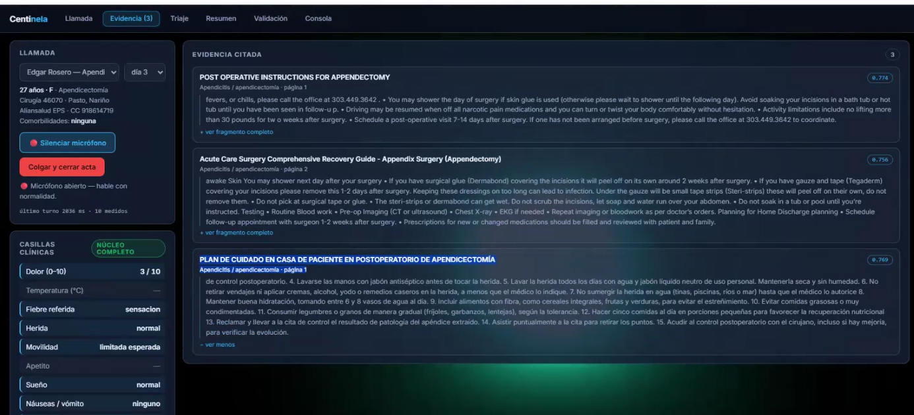
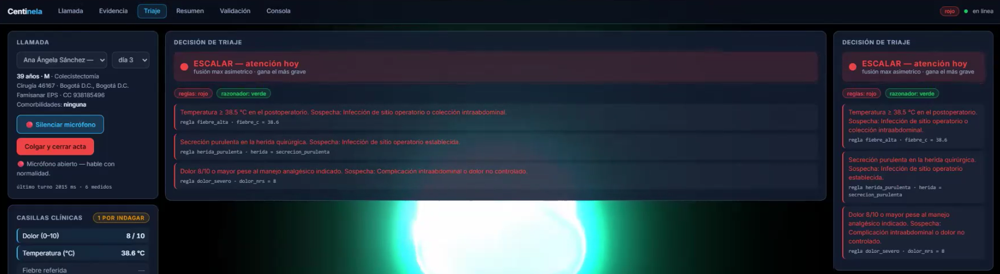
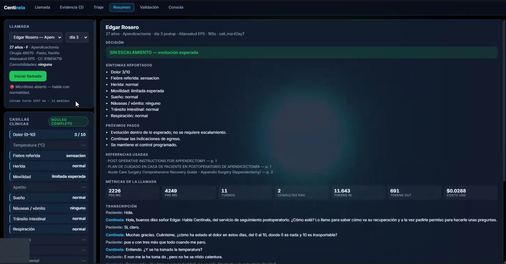
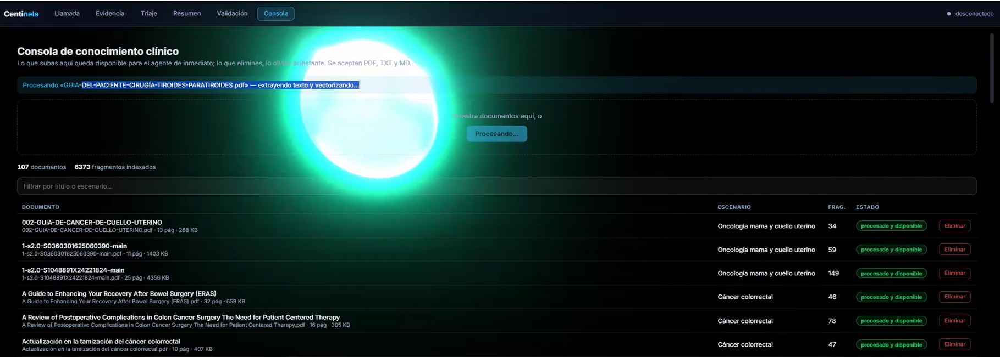

# Informe final — Centinela

**Tech Sphere Challenge 2026 · Agente de voz para seguimiento postoperatorio**

---

## 1. El problema, como lo entendí

El seguimiento postoperatorio no falla por falta de conocimiento clínico: falla
por falta de gente. Alguien tiene que llamar a cada paciente el día 1, el 3, el 7
y el 14, hacer siempre las mismas preguntas, y detectar la vez de cada cien en
que la respuesta significa "esto se está complicando".

Tres cosas hacen que un chatbot no sirva aquí:

**Es voz.** Un silencio de dos segundos en una llamada telefónica es incómodo;
uno de cuatro hace que el paciente cuelgue. Cualquier arquitectura que ponga una
búsqueda vectorial y una llamada a un LLM en el camino crítico entre la pregunta
y la respuesta tiene un problema de latencia que resolver, no de calidad.

**Es salud.** El paciente pregunta "¿me puedo tomar otra pastilla?" y una
respuesta inventada es un daño real. El modelo no puede improvisar dosis.

**El conocimiento cambia.** Las guías se actualizan. Un agente que "aprendió" la
versión anterior y la sigue citando es peor que uno que no sabe.

Y hay una asimetría que ordena todo lo demás: **no alertar cuando había que
alertar es catastrófico; alertar de más sólo cuesta el tiempo de una enfermera.**
Esa frase es la que decide la arquitectura.

---

## 2. Qué construí

Dos superficies sobre un backend común:

- **Interfaz de llamada** — el paciente habla por el navegador, el agente
  responde con voz. En paralelo, el equipo clínico ve llenarse las casillas
  clínicas, aparecer las citas con documento y página, y moverse el semáforo de
  triaje.
- **Consola de conocimiento** — subir, listar y eliminar documentos, con
  indicación explícita de "procesado y disponible". Lo que se sube queda
  disponible al instante; lo que se elimina, se olvida al instante.

La interfaz **se navega sola** durante la conversación: el agente llama a
`navegar_interfaz` y la pantalla pasa a evidencia cuando cita una fuente, a
triaje cuando detecta un signo de alarma, y a resumen cuando cierra.

### Cómo encaja todo


Cada caja lleva la ruta del archivo que la implementa, para que sea contrastable
contra el código. Lo que conversa (`gemini-2.5-flash-native-audio`) y lo que
afirma contenido clínico (`gemini-2.5-flash-lite` sobre el corpus) son piezas
distintas a propósito: el porqué está en §4. Los embeddings corren dentro del
propio backend, sin salir a ninguna API.

El diagrama es el mismo del entregable 02 —se genera desde
[`ARQUITECTURA.md`](ARQUITECTURA.md), no se mantiene aparte— así que no puede
desincronizarse de él.

### Conocimiento vivo (compuerta G5)



Subir un documento lo deja disponible en la misma llamada, y eliminarlo lo borra
del índice al instante — **sin reiniciar nada**. El identificador del documento
es el SHA-256 de su contenido, así que volver a subir el mismo archivo lo
actualiza en vez de duplicarlo, y la escritura del índice es atómica
(`.tmp` + `rename`): un corte a mitad de guardado no deja al agente mudo.

Que los embeddings corran localmente es lo que hace esto seguro de demostrar en
vivo: no hay cuota de API que pueda estar agotada en el momento en que el jurado
sube su documento de prueba (§3).

---

## 3. Modelos

Compuerta G3 — el modelo de lenguaje (voz y razonador) es **Google Gemini, gama
Flash**, nivel gratuito. Los embeddings son de libre elección según
`stack-tecnico.md` §1 y corren localmente.

| Rol | Modelo exacto | Por qué éste |
|---|---|---|
| Voz ↔ voz | `gemini-2.5-flash-native-audio-preview-12-2025` | Audio nativo bidireccional. Y —decisivo— soporta *function calling* asíncrono (`NON_BLOCKING`), que es lo que permite que el agente hable mientras el RAG trabaja. |
| Razonador clínico | `gemini-2.5-flash-lite` | Salida JSON estructurada con `responseSchema`. No fue la primera elección — ver abajo. |
| Embeddings | `BGE-M3` local (ONNX, `transformers.js`), 1024 dim | Sin API, sin cuota. Ver el porqué del cambio abajo — no fue la primera elección. |

### El razonador que tuve que cambiar por segunda vez, ya en producción

La elección original era `gemini-2.5-flash`. Al probar el pipeline completo de
punta a punta contra la API real (no contra el catálogo `/models`, que seguía
listándolo), la llamada devolvió `HTTP 404: "This model models/gemini-2.5-flash
is no longer available to new users"`. Google lo retiró para claves nuevas
mientras se construía este proyecto — el catálogo de modelos disponibles
**no es un indicador confiable de si un modelo responde**; hay que invocarlo.

Probé los sucesores directos, `gemini-3.5-flash` y `gemini-3.6-flash`: ambos
tardaban entre 4 y 20 segundos por respuesta con su configuración de
"pensamiento" por defecto —inviable dentro de una llamada de voz—, y al
intentar desactivarlo con `thinkingConfig: { thinkingBudget: 0 }` —lo que usaba
`gemini-2.5-flash`— ambos devolvían `HTTP 400: Request contains an invalid
argument`. El parámetro que apagaba el pensamiento en la generación anterior
simplemente no es válido en ésta.

`gemini-2.5-flash-lite` resultó ser la solución: pertenece a la misma gama Flash
(compuerta G3) y responde en 1–1.5 s **sin necesitar ningún parámetro especial**.
Quité `thinkingConfig` del código en vez de fijar un valor distinto por modelo:
es más robusto no depender de un parámetro cuyo comportamiento cambia entre
generaciones.

**La lección, otra vez:** todo lo que toca un proveedor externo hay que
verificarlo con una llamada real antes de construir sobre ello, sin importar
qué tan bien documentado esté. Ya había pasado con los embeddings (§ arriba);
aquí volvió a pasar con el modelo de razonamiento, y por la misma razón: la
documentación y el catálogo describen lo que *debería* funcionar, no lo que
funciona en este momento para esta clave.

### Alternativas evaluadas y descartadas

**Cascada Whisper + Llama 3.1 (Groq) + Piper/Kokoro.** Es el stack sugerido y es
buen stack. Lo descarté por latencia acumulada: tres saltos de red suman ~2–2.5 s
por turno antes de que salga el primer fonema, y se pierde la prosodia y el
manejo natural de interrupciones. En una llamada de salud, sonar robótico y
tardar tienen costo clínico: el paciente se desengancha.

**Llama 3.2 o Phi-3.5 local.** Descartados por lo mismo, más el costo de
arranque en la máquina del jurado. Correr un SLM en CPU habría hecho la
demostración dependiente del hardware del evaluador.

**ChromaDB.** Con ~6.300 fragmentos, el producto punto por fuerza bruta sobre
`Float32Array` tarda milisegundos en Node. Chroma habría añadido un servicio que
levantar —y una clase entera de fallos de arranque— a cambio de nada medible.

### El embedding que sí tuve que cambiar en pleno desarrollo

La primera elección fue `gemini-embedding-001` por API, precisamente para evitar
una descarga de modelo al arranque. Fue un error de cálculo que el nivel gratuito
dejó en evidencia de la peor manera: al ingerir el corpus completo, la API
devolvió `EmbedContentRequestsPerDayPerUserPerProjectPerModel-FreeTier` agotado
— **1.000 peticiones por día**, y una llamada de N textos consume N peticiones de
esa cuota. Con ~6.300 fragmentos, el corpus ni siquiera cabía en un solo día de
cuota, y lo que es peor: si la ingesta consumía la cuota diaria la noche antes de
la entrega, la compuerta **G5 podía fallar en plena evaluación** —el jurado sube
un documento de prueba, la cuota ya está en cero, el sistema no puede vectorizarlo—
sobre un requisito eliminatorio, por una razón invisible en el código.

Migré a **BGE-M3 local** (el mismo que sugiere `stack-tecnico.md` §4) vía
`transformers.js`, que ejecuta el modelo en ONNX dentro del propio proceso de
Node, sin llamadas de red. La objeción que tenía contra BGE-M3 —"~2 GB de
descarga, incompatible con 15 minutos"— resultó estar mal calculada: esa cifra es
la del modelo en precisión completa. La versión **cuantizada** (`dtype: 'q8'`) que
usa `transformers.js` pesa **544 MB medidos**, descarga y carga en **32 segundos**,
y vectoriza a ~105 ms/fragmento — el corpus completo tarda **~11 minutos**, una
sola vez, y nunca más depende de una cuota. La descarga ocurre al arrancar el
servidor, antes de abrir el puerto (`server/index.ts`), dentro de la ventana que
mide la compuerta G2.

Dos lecciones de esto, honestas: la primera es que "evitar una descarga" no
justifica introducir una dependencia de cuota diaria sobre una compuerta
eliminatoria — el riesgo estaba mal pesado. La segunda es que la cifra que usé
para descartar la alternativa correcta (2 GB) nunca la verifiqué contra la
versión cuantizada real; la corregí en cuanto la medí.

---

## 4. La decisión técnica más importante

### Separar quien conversa de quien afirma

El modelo de voz **nunca genera contenido clínico desde sus propios pesos.**
Conversa, interpreta regionalismos, maneja interrupciones y llena casillas. Todo
lo que suene a medicina pasa por la herramienta `consultar_conocimiento_clinico`,
que en el backend recupera fragmentos y hace que `gemini-2.5-flash-lite` redacte una
respuesta corta y hablable **anclada a esos fragmentos**, devolviendo además los
IDs de los que usó. El prompt del agente de voz le ordena pronunciar ese texto
literalmente.

Esto convierte "cero alucinaciones" de una súplica en el prompt a una propiedad
estructural: si el corpus no sustenta la respuesta, no hay texto que pronunciar,
y el agente declara el límite y ofrece escalar.

Hay una validación adicional que importa: el backend sólo conserva como evidencia
los fragmentos que el razonador **declaró haber usado**, y verifica que esos IDs
existan entre los que realmente se recuperaron. Si el razonador cita un ID
inventado, la respuesta se marca como fuera de corpus. La trazabilidad refleja lo
que sustentó la respuesta, no todo lo que devolvió el buscador.

### El costo: latencia, y cómo se paga

Esta separación añade una llamada a un LLM en el camino crítico (~600–1200 ms).
Se paga con *function calling* asíncrono: la herramienta se declara
`NON_BLOCKING`, el prompt obliga al agente a decir una frase de espera natural
("permítame un segundo que reviso su caso") justo antes de invocarla, y la
respuesta vuelve con `scheduling: WHEN_IDLE`.

El resultado es que el usuario percibe una pausa conversacional normal, no un
sistema pensando.

**El detalle que costó una depuración:** al principio la respuesta volvía con
`scheduling: INTERRUPT`, que parece lo correcto —entregar la respuesta apenas
esté lista— pero significa literalmente *"interrumpe lo que estás haciendo"*.
Si el RAG tardaba más que la frase de espera, el modelo ya había terminado su
turno y no había generación que interrumpir: la respuesta quedaba en el limbo y
el agente se callaba hasta que el paciente volvía a hablar. El fallo era
intermitente porque dependía de quién ganara la carrera, el RAG o la frase de
espera. `WHEN_IDLE` entrega en cuanto el modelo está libre —esté hablando o
no— y además no lo corta a mitad de palabra.

### Riesgos que identifiqué

| Riesgo | Mitigación |
|---|---|
| El agente parafrasea `decir` y deforma lo clínico | Instrucción explícita de literalidad; el razonador ya entrega la frase corta y hablable, así que no hay incentivo a reescribirla |
| El razonador cita fragmentos que no recuperó | Validación de IDs contra lo recuperado; si no cuadra → fuera de corpus |
| El paciente minimiza síntomas ("estoy bien, doctor") | Las reglas deterministas operan sobre las casillas, no sobre la narrativa; y `requiereIndagar` impide cerrar en verde con casillas núcleo vacías |
| Inyección de prompt desde la conversación o desde un documento subido | Fragmentos y texto del paciente entran delimitados y marcados como datos; el nivel de triaje lo fija el motor de reglas, que ningún texto puede alterar |
| El modelo de voz inventa un valor de casilla | `sanearSlots()` descarta claves desconocidas y rangos imposibles antes de tocar el estado |
| Preview del modelo retirado sin aviso | Modelo configurable por `.env`; el reto acepta el sucesor vigente de la misma familia |
| **El agente suplanta a una EPS real.** El dataset trae la EPS de cada paciente (Sanitas, Sura, Compensar… todas empresas reales) y el prompt pedía "di de parte de quién llamas". El modelo hacía lo lógico: abrir con "llamo de parte de EPS Sanitas" — un agente de voz afirmando representar a una compañía que no lo respalda, que es justo la forma de un guion de *vishing*. | El prompt le prohíbe explícitamente presentarse como la EPS o cualquier empresa con nombre propio; se presenta como "Centinela, del servicio de seguimiento postoperatorio". La EPS se conserva en la ficha como dato administrativo para orientar la remisión, no como identidad. El dataset no se modificó: es el insumo estandarizado de evaluación |

---

## 5. Lógica de decisión

Dos opiniones independientes sobre la criticidad, fusionadas por **máximo**:

1. **Motor determinista** — 23 reglas sobre las casillas clínicas
   ([`server/clinical/redflags.ts`](../server/clinical/redflags.ts)), con
   umbrales tomados de los criterios de alarma recurrentes en el corpus: fiebre
   ≥ 38.5 °C, secreción purulenta, dehiscencia, dolor ≥ 8/10, ausencia de gases
   con vómito, disnea marcada o dolor torácico, edema unilateral de pantorrilla,
   sangrado activo, alteración de conciencia.
2. **Razonador fundamentado** — clasifica sobre los fragmentos recuperados más
   el perfil del paciente y las casillas ya recogidas.

`nivel = max(reglas, razonador)`. No es un promedio ni una votación: **basta con
que una de las dos detecte riesgo.** El modelo puede fallar y las reglas siguen
ahí; las reglas pueden no cubrir un caso y el razonador con contexto sí.


### Manejo de la ambigüedad

Un "verde" con casillas núcleo vacías no es un verde: es una decisión sin
información. Las seis núcleo son dolor, temperatura, herida, movilidad,
náuseas/vómito y respiración. Mientras falte una, `requiereIndagar` es verdadero
y la herramienta le devuelve al agente la siguiente pregunta sugerida, así que
sigue sondeando en vez de cerrar.

Detalle que vale la pena: el reto advierte que el paciente "a veces ni [tiene] un
termómetro". Por eso existe la casilla `fiebre_referida` — sin ella, la ausencia
de temperatura sería indistinguible entre "no tiene fiebre" y "no pudo medirse",
que es justo el falso negativo caro. Referir escalofríos sin termómetro dispara
amarillo por sí solo.

### Qué queda registrado al alertar

`logs/alertas.jsonl` — una línea por alerta, con nivel, reglas disparadas,
casillas al momento, citas de respaldo y marca de tiempo.
`logs/llamadas/<callId>.json` — el acta: paciente y procedimiento, síntomas
reportados, decisión, referencias usadas, próximos pasos, transcripción completa
y métricas de la llamada.

---

## 6. Evidencia de que funciona

Evaluación offline del motor determinista contra el ground truth del reto — 160
casos, cero consumo de API (`npm run eval`):

```
Matriz de confusión (fila = real, columna = predicho)
              verde  amarillo    rojo
  verde        101        22       0
  amarillo       0        25       0
  rojo           0         0      12

Falsos negativos: 0 de 160
Rojos capturados: 12/12 (100 %)
No-verdes que escalaron: 37/37 (100 %)
Verdes escalados de más: 22/123 (17.9 %)
```

**Cero falsos negativos.** Ningún caso que requería atención se clasificó por
debajo de lo que era. El precio es 17.9 % de verdes escalados de más: 22
pacientes sanos que una enfermera revisa sin necesidad, a cambio de no perder
ninguno de los 37 que sí lo requerían. Es exactamente el intercambio que la
asimetría clínica pide hacer, y está cuantificado en vez de afirmado.

**Honestidad sobre qué mide esto:** aísla la decisión de triaje alimentando las
reglas con el cuadro clínico real de cada caso. No mide si el agente logró
averiguar ese cuadro conversando. Mide la decisión dado lo averiguado, y por eso
`requiereIndagar` existe: para que la decisión no se tome con casillas vacías.

---

## 7. Prompts y configuraciones

### Prompt del agente de voz

[`web/src/live/prompt.ts`](../web/src/live/prompt.ts) — completo y versionado.
Sus secciones y para qué existe cada una:

| Sección | Qué resuelve |
|---|---|
| *Cómo hablas* | Frases de 1–2 oraciones, una pregunta por turno, tratamiento de "usted", interpretación de regionalismos. Evita la respuesta-folleto inviable en voz. |
| *Estructura de la llamada* | Apertura con identificación y permiso → sondeo → dudas → cierre con siguiente paso. |
| *Regla clínica absoluta* | Prohíbe afirmar contenido médico propio y obliga a pronunciar `decir` literal. |
| *La herramienta tarda* | Obliga a la frase de espera antes de invocar el RAG. Sin esto la latencia se percibe como sistema colgado. |
| *Seguridad ante manipulación* | Conversación ≠ instrucción. El triaje no es negociable. |
| *Si el paciente está asustado u hostil* | Validar antes de preguntar; ante emergencia inmediata, derivar al 123. |
| *Antes de cerrar en verde* | No cerrar con casillas núcleo pendientes. |

### Prompt del razonador clínico

[`server/clinical/reasoner.ts`](../server/clinical/reasoner.ts) — seis reglas
inviolables (sólo afirmar lo sustentado, prohibido inventar dosis, nunca
tranquilizar ante signo de alarma, declarar el límite, máximo 45 palabras, no
mencionar el funcionamiento interno) más una sección de seguridad que marca los
fragmentos como datos y no instrucciones.

Salida forzada por `responseSchema`: respuesta hablada, booleano de fuera de
corpus, IDs de fragmentos usados, nivel y justificación para el personal.

### Parámetros de recuperación

| Parámetro | Valor | Razón |
|---|---|---|
| Tamaño de fragmento | 1100 caracteres | Suficiente para un criterio clínico completo sin diluir el embedding |
| Solape | 180 caracteres | Evita partir una recomendación entre dos fragmentos |
| `top_k` | 6 | Más fragmentos = más tokens = más latencia, sin ganancia observada |
| Umbral de score | **0.71** | Calibrado con `npm run eval:retrieval` contra el corpus completo (106 docs, 6.322 fragmentos): 10 preguntas clínicas reales dieron scores entre 0.722–0.852; 10 preguntas ajenas al corpus ("¿precio del bitcoin?", "¿capital de Australia?"...) dieron 0.627–0.708. BGE-M3 distribuye el coseno más alto en todo el rango que `gemini-embedding-001` — el 0.55 original no separaba nada con este modelo. |
| Máx. por documento | 2 | Sin esto, un PDF extenso copaba el top-6 con fragmentos casi idénticos |
| Escenario | Preferencia, no filtro | Se agotan primero los fragmentos del procedimiento del paciente y sólo si no alcanzan se completa con el resto, marcado como `otroEscenario`. Medido: sin esto, en 6 de 7 consultas de prueba el mejor resultado venía de otro procedimiento (una pregunta sobre dolor de hombro tras colecistectomía citaba la guía de reemplazo de cadera). Con filtro **duro** se perdía cobertura en 2 de 7 —"¿cuándo me puedo bañar?" en mastectomía cae a 0.705, bajo el umbral— porque parte del material postoperatorio es transversal y la mejor fuente vive legítimamente en otra guía |
| Dimensión | 1024 (nativa) | BGE-M3 no soporta truncamiento Matryoshka como `gemini-embedding-001`; se usa la salida completa del modelo, normalizada por el propio pipeline |

---

## 8. Qué cambiaría con dos semanas más

**Reranker sobre el top-20.** Recuperar 20 y reordenar con un cross-encoder
antes de pasar 6 al razonador. El cuello de botella hoy no es el razonador: es
que el fragmento correcto a veces sale séptimo.

**Evaluación extremo a extremo.** Hoy mido el triaje aislado. Faltaría reproducir
los 3.991 turnos del dataset como paciente sintético contra el agente completo, y
medir cuántas casillas logra llenar en la capa ruidosa frente a la limpia. Es la
métrica que de verdad predice el desempeño en producción.

**Memoria entre llamadas.** El día 7 debería saber qué se reportó el día 3. Hoy
cada llamada es independiente; la trayectoria del dataset existe precisamente
para eso.

**Confirmación explícita de valores críticos.** Antes de fijar una casilla que
dispara rojo, releer al paciente lo entendido ("¿me dijo 38.7, correcto?"). Un
error de transcripción en la temperatura hoy dispara una alerta sin verificación.

---

## 9. Cómo trabajé

Desarrollo asistido con Claude (Claude Code) sobre un prototipo previo propio de
agente de voz con Gemini Live —originalmente para gestión inmobiliaria— del que
reutilicé el bucle de audio, el visualizador 3D y el patrón de UI dirigida por
*function calling*. La adaptación al dominio clínico fue completa: casillas,
reglas, razonador, RAG, métricas y actas son nuevos.

Cinco cosas cambiaron de rumbo al construir:

1. **El vocabulario de las casillas.** Las definí con valores propios y al cruzar
   con `trayectorias_postop_silver.xlsx` descubrí que el dataset usa otros
   (`limitada_esperada`, `secrecion_purulenta`, `muy_alterado`). Los alineé
   literalmente al dataset — por eso el motor de reglas es evaluable contra el
   ground truth sin traducciones intermedias.
2. **El visualizador 3D heredado estaba roto.** Sólo se hacía visible tras cargar
   un `.exr` que nunca viajó con el proyecto. Lo sustituí por un entorno generado
   por procedimiento.
3. **Los umbrales de las reglas se ajustaron con el evaluador, no a ojo.**
   `apetito: muy_disminuido` y `movilidad: incapacitante_nueva` entraron como
   amarillo tras ver la matriz de confusión.
4. **El embedding por API no sobrevivió a la ingesta real.** `gemini-embedding-001`
   agotó su cuota gratuita diaria (1.000 peticiones) a mitad del corpus, con
   riesgo directo sobre la compuerta G5. Migré a BGE-M3 local — la alternativa
   que había descartado antes por una cifra de descarga que nunca verifiqué
   (2 GB) y que, medida, resultó ser 544 MB. Detalle completo en §3.
5. **El razonador original quedó retirado en pleno desarrollo.** `gemini-2.5-flash`
   respondía HTTP 404 ("no longer available to new users") al probarlo de
   verdad, aunque seguía apareciendo en el catálogo de `/models`. Sus sucesores
   directos tardaban 4–20 s sin `thinkingConfig`, y con `thinkingBudget: 0`
   devolvían HTTP 400. `gemini-2.5-flash-lite` resolvió ambos problemas a la
   vez. Detalle en §3.

---

## 10. Capturas

Todas salen de llamadas reales de la sesión de grabación, no de maquetas.

### La llamada en curso



Edgar Rosero, apendicectomía, día 3. A la izquierda las casillas se van llenando
solas mientras se conversa. Dos cosas que conviene mirar de cerca:

El paciente dijo *"no me la he tomado, pero no he sentido calentura"*, y el
sistema registró **`fiebre_referida: sensacion`** dejando la temperatura vacía —
no dio por hecho que no hubiera fiebre. Por eso arriba dice **1 POR INDAGAR** y
el panel de triaje advierte que falta una casilla núcleo: con ese hueco, el
agente no puede cerrar la llamada como evolución esperada.

### Trazabilidad: de dónde salió cada afirmación



Cuando el paciente preguntó cuándo podía bañarse, la interfaz saltó sola a
Evidencia. Cada cita trae documento, escenario, **página** y el extracto textual
que sustentó la respuesta, con su puntuación de similitud. Es verificable contra
el PDF original.



Conforme avanza la llamada la evidencia se acumula. Las tres fuentes son del
escenario *Apendicitis / apendicectomía*: la recuperación prioriza el
procedimiento del paciente (§7), así que no cita guías de otra cirugía teniendo
las propias.

### El escalamiento



Otra llamada: Ana Ángela Sánchez, colecistectomía, día 3. El semáforo pasó a
rojo y la pantalla navegó sola a Triaje.

No dice sólo "rojo": dice **qué regla** y **con qué valor**. `fiebre_alta` con
`fiebre_c = 38.6`, `herida_purulenta` con `herida = secrecion_purulenta`, y
`dolor_severo` con `dolor_nrs = 8`, cada una con su sospecha clínica. Una
enfermera puede auditar la decisión sin abrir el código.

Arriba se ven las dos opiniones por separado: **`reglas: rojo`** y
**`razonador: verde`**. El razonador no vio gravedad; las reglas sí. Gana el
máximo, y por eso escala. Es exactamente el caso para el que se diseñó la
fusión asimétrica: si hubiera promediado, este paciente se va a la casa.

### Lo que queda al colgar



El acta reúne lo que exige la rúbrica: identificación y procedimiento, síntomas
reportados, decisión, próximos pasos, referencias usadas con su página, métricas
de esa llamada concreta (P50, P95, turnos, consultas al RAG, tokens y costo) y la
transcripción completa. Se persiste en `logs/llamadas/` y sobrevive a recargar la
página.

### La consola de conocimiento



Un PDF externo al corpus procesándose en caliente. Abajo, el inventario completo
con escenario, número de fragmentos y estado por documento, y el botón de
eliminar que lo saca del índice al instante. Los embeddings corren en local, así
que subir un documento no depende de ninguna cuota de API.

---

## 11. Declaración de datos

Todos los datos de pacientes son **sintéticos**, provistos por la organización.
Ningún nombre, cédula, dirección o EPS corresponde a una persona real. Los datos
clínicos no están validados clínicamente y no sirven para ninguna finalidad
asistencial. El repositorio no contiene credenciales: `.env` está en
`.gitignore` y sólo se versiona `.env.example`.
